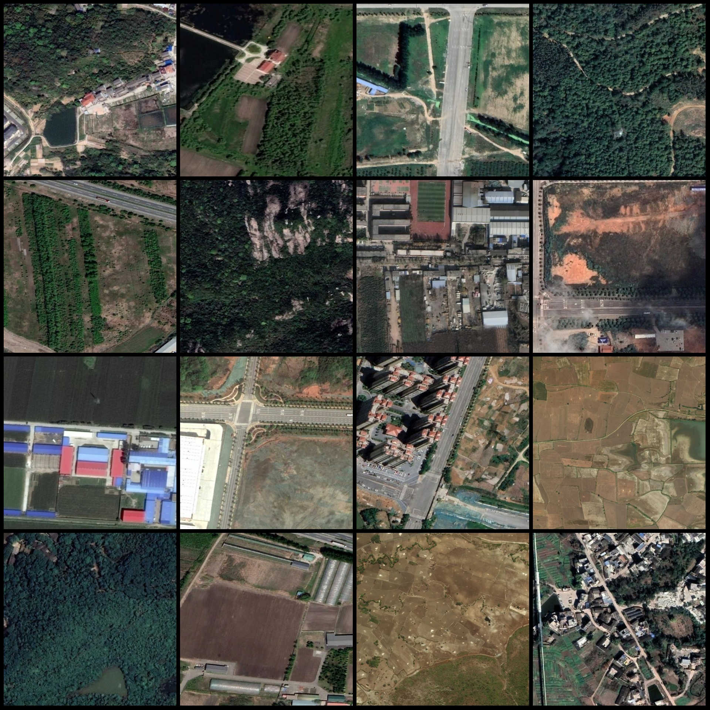
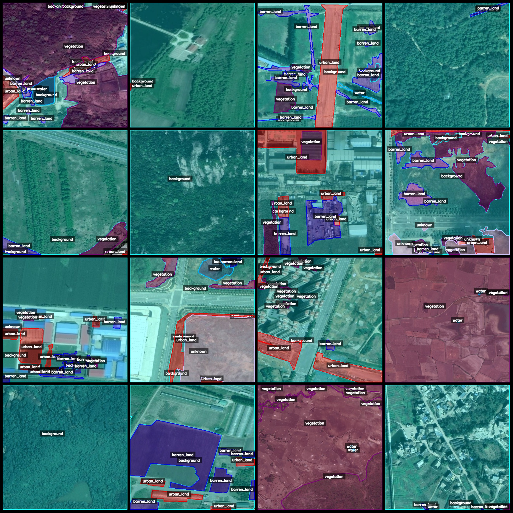
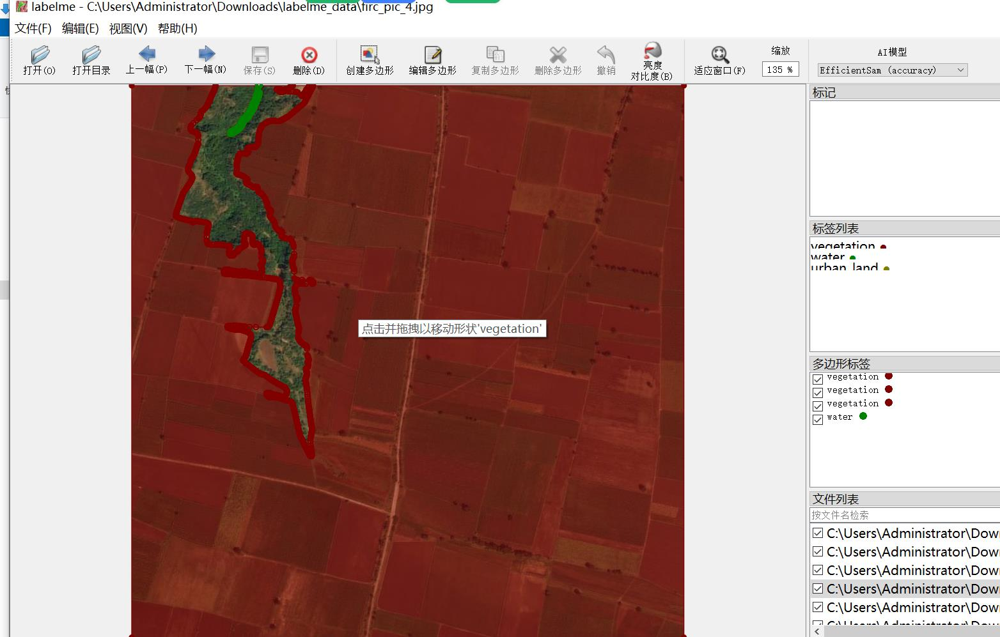

# Remote Sensing Image Land Type Identification and Segmentation Dataset - LabelMe Format, 5704 Images, 6 Categories

The dataset format: labelme format (without mask files, only including jpg images and corresponding json files).

Number of images: 5704 jpg files.
Number of labels: 5704.
Number of categories: 6.
Category names in the labels: ["background", "barren_land", "unknown", "urban_land", "vegetation", "water"].
Number of boxes per category:
- background (background): 16984
- barren_land (barren land): 14816
- unknown (unknown): 7610
- urban_land (urban land): 14631
- vegetation (vegetation): 16713
- water (water): 4202
Total number of boxes: 74956.
Used labeling tool: labelme=5.5.0.
Image resolution: 640x640.
Labeling rules: Polygons are drawn around the categories.
Important note: The dataset can be opened and edited using labelme, but the json dataset needs to be converted into mask, yolo, or coco format for semantic segmentation or instance segmentation.
Special declaration: This dataset does not guarantee the accuracy of the trained models or weight files.
Image preview:
Example of labeled images (selecting 16 random images):
Labeled drawing results:
Labelme editing image example:

## Images

Here is a pay link on Stripe ( https://buy.stripe.com/3cs8yP7sY87d0vu9AB ). Please contact me lonlonago@foxmail.com after funding $89, and I will send you a complete data files , thank you!

